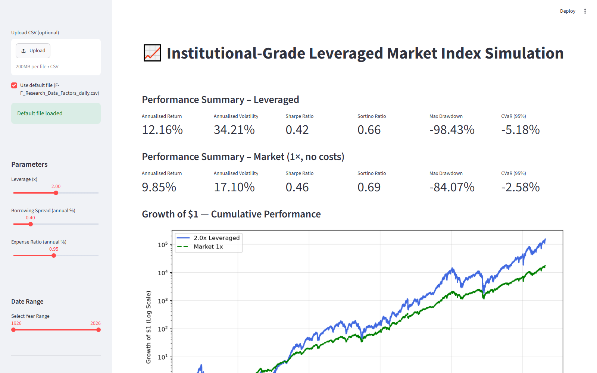
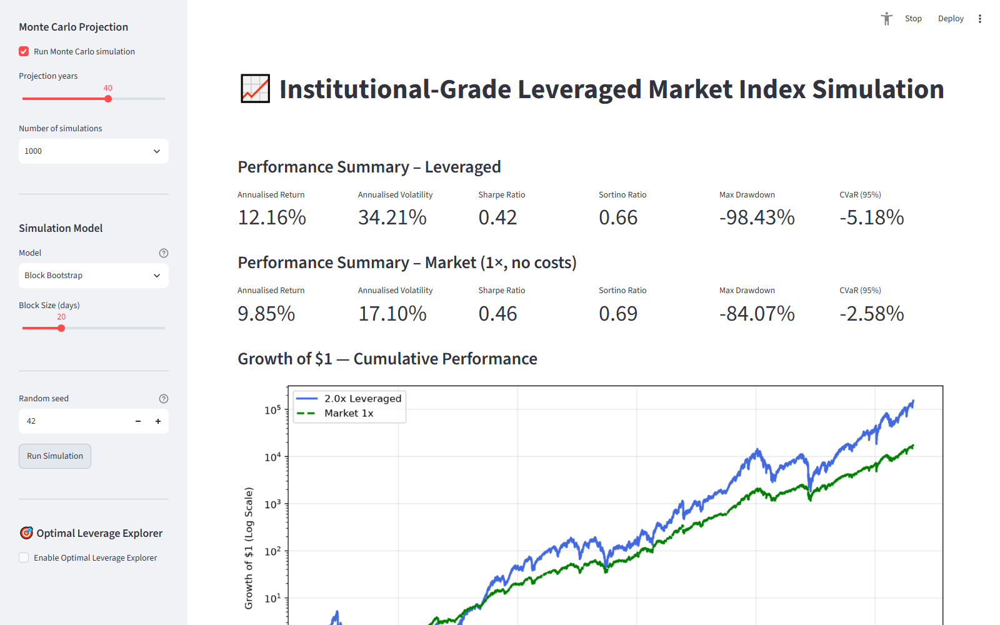
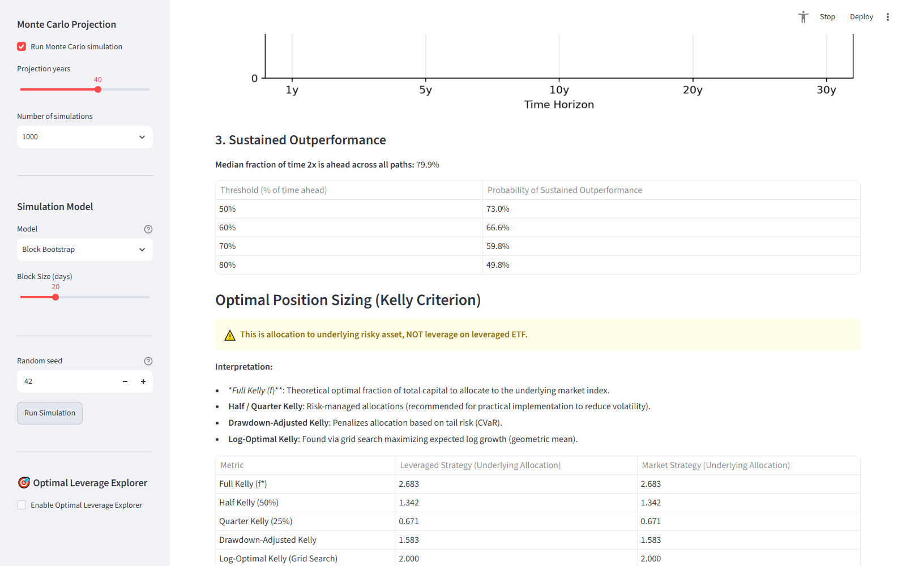
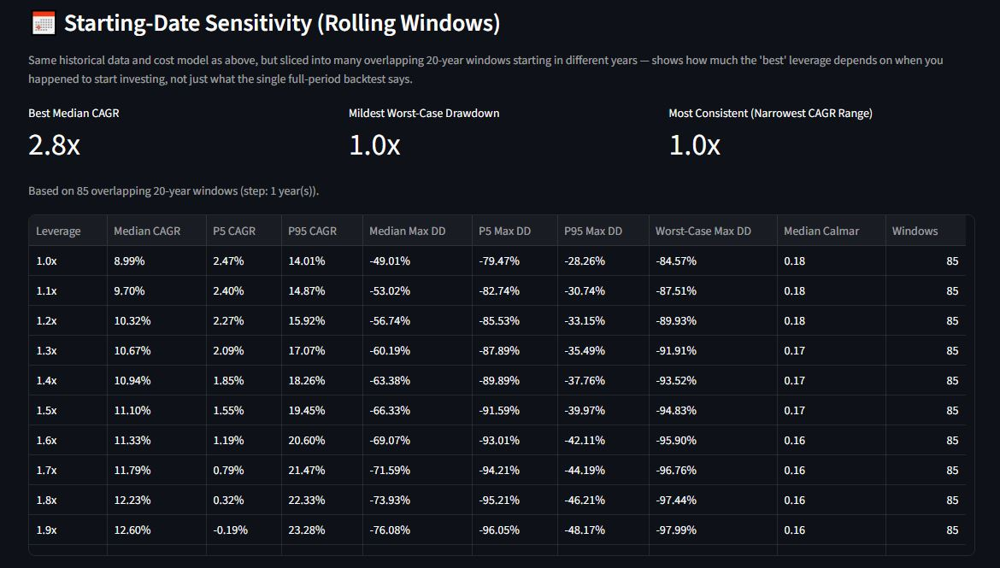
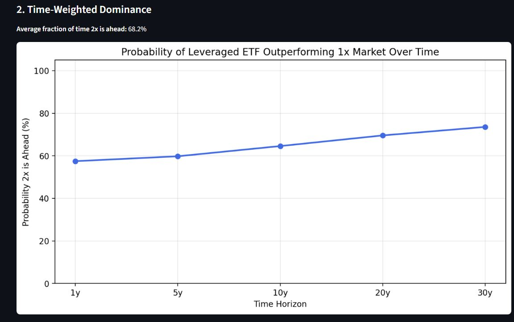

# 📈 Institutional-Grade Leveraged Market Index Simulator

A Streamlit application for backtesting and stress-testing leveraged index strategies (e.g. 2x/3x leveraged ETFs) against ~100 years of Fama-French daily market data. It combines a historical backtest engine, a multi-model Monte Carlo simulator, a Kelly-criterion position sizer, and an optimal-leverage explorer into a single interactive dashboard.

The project was built to answer a question that most "does leverage work?" blog posts get wrong: **the right amount of leverage depends heavily on which risk measure you optimize for, which market regime you're in, and how much of history you condition on** — this tool makes all three of those trade-offs explorable instead of asserting a single answer.

## Screenshots

**Historical backtest — growth of $1, log-scale, cost-adjusted**


**Monte Carlo projection — percentile fan chart across simulated paths**


**Kelly-criterion position sizing and sustained-outperformance analysis**


**Starting-date sensitivity — rolling 20-year windows**


**Time-weighted dominance — probability leverage stays ahead by horizon**


## Features

### Historical Backtest
- Daily compounding of leveraged returns net of financing spread and expense ratio, replicating how real leveraged ETFs actually accrue cost.
- Sharpe/Sortino computed from **monthly-compounded** excess returns (not raw daily returns) — the convention used by Portfolio Visualizer and testfol.io, and the only version of these ratios that actually degrades with leverage the way a real fund's do.
- CVaR (95%), max drawdown, and annualized volatility, with an adjustable date range.

### Monte Carlo Simulation Engine
Four interchangeable return-generating models, all JIT-compiled with Numba for speed:
- **Block Bootstrap** — resamples contiguous historical blocks to preserve autocorrelation.
- **IID Bootstrap** — i.i.d. resampling of historical daily returns.
- **GARCH(1,1)** — fits volatility clustering to history, with a choice of Gaussian, Student-t, or empirically-resampled innovations, plus an automatic 4th-moment stability check that warns when the fitted model implies unbounded long-run tail risk.
- **Markov Regime-Switching** — a 3-state (Bull/Neutral/Crisis) Gaussian-mixture model with transition-matrix simulation.

Risk-free rate paths are bootstrapped in annual blocks (not i.i.d.) so financing-cost regimes (ZIRP, hiking cycles) persist realistically across a simulated path.

### Dominance & Sensitivity Analysis
- **Conditional dominance**: does leverage still win inside crash/neutral/bull regimes specifically?
- **Time-weighted dominance**: probability leverage is ahead at 1/5/10/20/30-year horizons.
- **Sustained outperformance**: probability leverage stays ahead for ≥50/60/70/80% of the holding period.
- **Starting-date sensitivity**: rolling-window backtests showing how much the "optimal" leverage depends on when you started investing, not just the single full-sample answer.

### Optimal Leverage Explorer
Sweeps a full leverage grid (e.g. 1.0x–3.0x) against the *same* simulated paths, so every comparison is a genuine paired comparison rather than an independent re-draw:
- Probability of beating 1x / beating the next-lower leverage step
- Optimal-leverage frequency and average rank across simulations
- Probability-of-regret and pairwise win-matrix tables
- Survival-optimal leverage subject to a max probability-of-ruin constraint

### Kelly Criterion
Full, half, quarter, drawdown-adjusted, and grid-search log-optimal Kelly fractions for the underlying asset, with guidance on translating the underlying allocation into an actual leveraged-ETF position size.

## Tech Stack

| Layer | Tools |
|---|---|
| UI | [Streamlit](https://streamlit.io/) |
| Numerics | NumPy, pandas, SciPy |
| Simulation speed | [Numba](https://numba.pydata.org/) (`@jit(nopython=True, parallel=True)`) for the Monte Carlo path generators |
| Volatility modeling | [arch](https://bashtage.github.io/arch/) (GARCH(1,1)) |
| Regime detection | scikit-learn (Gaussian Mixture Models) |
| Plotting | Matplotlib |

## Getting Started

```bash
git clone https://github.com/<your-username>/leveraged-market-simulator.git
cd leveraged-market-simulator
pip install -r requirements.txt
streamlit run app.py
```

The repo ships with `F-F_Research_Data_Factors_daily.csv` (daily Mkt-RF, SMB, HML, and RF factors) so the app runs immediately with no setup. You can also upload your own CSV in the same format via the sidebar.

## Data Source

Daily factor data is from Kenneth R. French's [Data Library](https://mba.tuck.dartmouth.edu/pages/faculty/ken.french/data_library.html) (Fama-French Research Data Factors, daily), used under the terms described there. It is provided for research/educational use.

## Work in Progress

This project is still evolving. Known gaps and planned work:

- **Sharpe/Sortino are not yet correct for the Monte Carlo and block-bootstrap simulations once leverage is introduced.** The periodic-compounding risk-ratio calculation was built for the historical backtest and doesn't yet correctly carry over to leveraged simulated paths — this needs to be fixed before those numbers can be trusted.
- **Diversifiers (managed futures, bonds, gold) are not modeled yet.** The working hypothesis is that adding these as diversifiers alongside a leveraged core would improve risk-adjusted returns while cushioning the drawdowns leverage amplifies — this is a planned addition, not yet implemented.
- **200-day moving average timing overlay** — planned test to see whether a simple trend filter meaningfully changes the leverage/drawdown trade-off.
- **50% momentum / 50% small-cap blended portfolio** — planned test, as this combination looks promising and hasn't been backtested here yet.

### What the project has shown so far

Leverage widens the whole distribution of outcomes, not just the average one: it raises both the odds of a standout "home run" result and the odds of a near-total loss, and it introduces a much wider spread of plausible in-between outcomes than an unleveraged position ever produces. That's the core trade-off the tool is built to make visible rather than hide behind a single expected-return number.

## Disclaimer

This tool is for educational and research purposes only. It is not investment advice. Historical backtests and Monte Carlo projections are not guarantees of future performance — leveraged products carry substantial risk, including total loss of principal.
